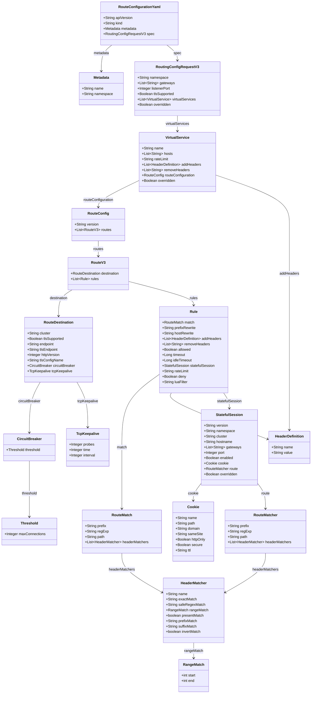

# RouteConfiguration to Istio Entity Mapping

## Overview

This document maps the RouteConfiguration custom resource entities to their corresponding Istio/Gateway API entities.

## RouteConfiguration Class Diagram

## Entity Mapping Table

### RouteConfiguration Core Mapping

| RouteConfiguration Entity                   | Gateway API/Istio Entity                      | Mapping Description                                                              | Notes                                                            |
|---------------------------------------------|-----------------------------------------------|----------------------------------------------------------------------------------|------------------------------------------------------------------|
| `RouteConfigurationYaml.apiVersion`         | `HTTPRoute.apiVersion` / `Gateway.apiVersion` | Версия API для CR, в которую вы конвертируете (`gateway.networking.k8s.io/v1`).  | Выбирается по целевому объекту (обычно `HTTPRoute` + `Gateway`). |
| `RouteConfigurationYaml.kind`               | `HTTPRoute.kind` / `Gateway.kind`             | Тип целевого ресурса Gateway API (`HTTPRoute`, при необходимости ещё `Gateway`). |                                                                  |
| `RouteConfigurationYaml.metadata.name`      | `HTTPRoute.metadata.name`                     | Имя `HTTPRoute`, формируемое из вашего `RouteConfiguration`/`VirtualService`.    |                                                                  |
| `RouteConfigurationYaml.metadata.namespace` | `HTTPRoute.metadata.namespace`                | Namespace HTTPRoute.                                                             | Обычно равен `spec.namespace` из `RoutingConfigRequestV3`.       |
| `RouteConfigurationYaml.spec`               | `HTTPRoute.spec`                              | Основное содержимое HTTPRoute (parentRefs, hostnames, rules и т.д.).             |                                                                  |

### Metadata

| RouteConfiguration Entity | Gateway API/Istio Entity                                      | Mapping Description                       | Notes                                    |
|---------------------------|---------------------------------------------------------------|-------------------------------------------|------------------------------------------|
| `Metadata.name`           | `HTTPRoute.metadata.name` / `Gateway.metadata.name`           | Имя генерируемого ресурса.                |                                          |
| `Metadata.namespace`      | `HTTPRoute.metadata.namespace` / `Gateway.metadata.namespace` | Namespace для ресурсов Gateway API/Istio. | Обычно совпадает с namespace приложения. |

### Spec

| RouteConfiguration Entity                  | Gateway API/Istio Entity                                                 | Mapping Description                                                            | Notes                                                                                                |
|--------------------------------------------|--------------------------------------------------------------------------|--------------------------------------------------------------------------------|------------------------------------------------------------------------------------------------------|
| `RoutingConfigRequestV3.namespace`         | `HTTPRoute.metadata.namespace` / `Gateway.metadata.namespace`            | Namespace для генерируемых HTTPRoute (и при необходимости Gateway).            | Когда именно не совпадает с `RouteConfigurationYaml.metadata.namespace`?                             |
| `RoutingConfigRequestV3.gateways[]`        | `HTTPRoute.spec.parentRefs[].name` / `.namespace` / `.kind=Gateway`      | Список целевых Gateway, к которым будет «прикреплён» HTTPRoute.                | Для каждого значения создаётся `parentRefs` на `Gateway` (при необходимости разный ns).              |
| `RoutingConfigRequestV3.listenerPort`      | `Gateway.spec.listeners[].port`                                          | Целевой порт листенера Gateway, к которому должен быть привязан HTTPRoute.     | В `parentRefs[].sectionName` можно ссылаться на listener по имени, если вы так проектируете Gateway. |
| `RoutingConfigRequestV3.tlsSupported`      | `Gateway.spec.listeners[].protocol` / Istio `Gateway.spec.servers[].tls` | Флаг, что маршруты должны обслуживаться через TLS.                             | В Gateway API: `protocol: HTTPS` / `TLS`; в Istio: `tls.mode`, `credentialName` и т.п.               |
| `RoutingConfigRequestV3.virtualServices[]` | `HTTPRoute.spec.rules[]` + `HTTPRoute.spec.hostnames[]`                  | Набор виртуальных хостов и правил, которые трансформируются в rules HTTPRoute. |                                                                                                      |
| `RoutingConfigRequestV3.overridden`        | (нет прямого аналога) / аннотация                                        | Флаг, что конфигурация переопределена более приоритетным источником.           |                                                                                                      |

### Virtual Service

| RouteConfiguration Entity           | Gateway API/Istio Entity                                                                              | Mapping Description                                                      | Notes                                                                                                                                 |
|-------------------------------------|-------------------------------------------------------------------------------------------------------|--------------------------------------------------------------------------|---------------------------------------------------------------------------------------------------------------------------------------|
| `VirtualService.name`               | `HTTPRoute.metadata.name` (частично)                                                                  | Имя виртуального сервиса, используемое при формировании имени HTTPRoute. | Можно собирать: `<gateway>-<virtualservice>-httproute`.                                                                               |
| `VirtualService.hosts[]`            | `HTTPRoute.spec.hostnames[]`                                                                          | Список хостов, на которые матчится маршрут.                              |                                                                                                                                       |
| `VirtualService.rateLimit`          | Istio `EnvoyFilter` / `EnvoyFilter`-подобная конфигурация / Istio `VirtualService` + RateLimitService | Общий rate limit для VS.                                                 | В чистом Gateway API rate limiting стандартизировано слабо; для Envoy/Istio чаще используют EnvoyFilter или внешний RateLimitService. |
| `VirtualService.addHeaders[]`       | `HTTPRoute.spec.rules[].filters[]` с `type: RequestHeaderModifier` / `ResponseHeaderModifier`         | Заголовки, добавляемые ко всем правилам данного VirtualService.          | В Gateway API header-фильтры задаются на уровне rules; ваш уровень VirtualService придётся «размазывать» по всем rules.               |
| `VirtualService.removeHeaders[]`    | `HTTPRoute.spec.rules[].filters[].requestHeaders.remove` / `.responseHeaders.remove`                  | Заголовки, удаляемые на уровне VirtualService.                           | Аналогично — применяется к каждому rule, где генерируется `HeaderModifier`.                                                           |
| `VirtualService.routeConfiguration` | `HTTPRoute.spec.rules[]`                                                                              | Ссылка на RouteConfig, откуда берутся destination + rules.               | `RouteConfig` = фактический содержимое `HTTPRoute.spec.rules`.                                                                        |
| `VirtualService.overridden`         | (нет прямого аналога) / аннотация                                                                     |                                                                          |                                                                                                                                       |

### RouteConfig

| RouteConfiguration Entity | Gateway API/Istio Entity                               | Mapping Description                    | Notes                                                                                      |
|---------------------------|--------------------------------------------------------|----------------------------------------|--------------------------------------------------------------------------------------------|
| `RouteConfig.version`     | `HTTPRoute.metadata.annotations["mesh/route-version"]` | Версия конфигурации маршрутов.         |                                                                                            |
| `RouteConfig.routes[]`    | `HTTPRoute.spec.rules[]`                               | Набор маршрутов к разным destinations. | Один элемент вашего `routes[]` → один или несколько HTTPRoute.rules с разными backendRefs. |

### RouteV3

| RouteConfiguration Entity | Gateway API/Istio Entity                     | Mapping Description                                    | Notes                                                                                                |
|---------------------------|----------------------------------------------|--------------------------------------------------------|------------------------------------------------------------------------------------------------------|
| `RouteV3.destination`     | `HTTPRoute.spec.rules[].backendRefs[]`       | Описание backend-сервиса / кластера, куда идёт трафик. |                                                                                                      |
| `RouteV3.rules[]`         | `HTTPRoute.spec.rules[]` (matches + filters) | Набор правил матчей/фильтров для одного destination.   | Можно формировать по схеме: один `HTTPRouteRule` на rule или объединять, если совпадают destination. |

### Rule

| RouteConfiguration Entity | Gateway API/Istio Entity                                                                     | Mapping Description                             | Notes                                                                                                         |
|---------------------------|----------------------------------------------------------------------------------------------|-------------------------------------------------|---------------------------------------------------------------------------------------------------------------|
| `Rule.match`              | `HTTPRoute.spec.rules[].matches[]`                                                           | Условие матчинга пути и заголовков.             |                                                                                                               |
| `Rule.prefixRewrite`      | `HTTPRoute.spec.rules[].filters[].type=URLRewrite` / `.urlRewrite.path.prefix`               | Переписывание префикса пути.                    | Gateway API имеет `URLRewrite` с `path` (full prefix) и `hostname`.                                           |
| `Rule.hostRewrite`        | `HTTPRoute.spec.rules[].filters[].type=URLRewrite` / `.urlRewrite.hostname`                  | Переписывание host при проксировании.           | Можно также использовать Istio `VirtualService.http[].rewrite.authority`.                                     |
| `Rule.addHeaders[]`       | `HTTPRoute.spec.rules[].filters[].type=RequestHeaderModifier/ResponseHeaderModifier`         | Заголовки, добавляемые на уровне правила.       | Если вы разделяете req/resp, может понадобиться доп. логика.                                                  |
| `Rule.removeHeaders[]`    | `HTTPRoute.spec.rules[].filters[].requestHeaders.remove` / `.responseHeaders.remove`         | Заголовки, удаляемые на уровне правила.         | Аналогично VirtualService.removeHeaders, но приоритет выше.                                                   |
| `Rule.allowed`            | `HTTPRoute.spec.rules[]` (наличие/отсутствие) / `matches[].method`                           | Флаг, разрешён ли маршрут.                      |                                                                                                               |
| `Rule.timeout`            | Istio `VirtualService.http[].timeout`                                                        | Таймаут обработки запроса до backend.           | В Gateway API таймауты пока стандартизованы плохо; Istio даёт полный контроль.                                |
| `Rule.idleTimeout`        | Istio `DestinationRule.trafficPolicy.connectionPool.http.idleTimeout` / Envoy cluster config | Idle timeout для HTTP соединения.               | Чаще описывается на уровне cluster / DestinationRule, а не конкретного route.                                 |
| `Rule.statefulSession`    | Istio `VirtualService` + `DestinationRule` (session affinity / consistent hash)              | Описание stateful-сессий / sticky-sessions.     | Прямого аналога в Gateway API нет, делается на L7/L4 LB уровне (DestinationRule). См. ниже `StatefulSession`. |
| `Rule.rateLimit`          | EnvoyFilter / Istio rate limit                                                               | Rate limit для конкретного rule.                | Аналогично VirtualService.rateLimit, но более гранулярный уровень.                                            |
| `Rule.deny`               | `HTTPRoute.spec.rules[].filters[].type=RequestRedirect` / AuthN/AuthZ policies               | Явный запрет маршрута.                          |                                                                                                               |
| `Rule.luaFilter`          | EnvoyFilter (Lua filter)                                                                     | Пользовательский Lua-фильтр на уровне маршрута. | В Gateway API нет прямого аналога; остаётся EnvoyFilter / WASM фильтры.                                       |

### RouteDestination

| RouteConfiguration Entity         | Gateway API/Istio Entity                                                                                                | Mapping Description                                   | Notes                                                                                                                 |
|-----------------------------------|-------------------------------------------------------------------------------------------------------------------------|-------------------------------------------------------|-----------------------------------------------------------------------------------------------------------------------|
| `RouteDestination.cluster`        | ??? `HTTPRoute.spec.rules[].backendRefs[].name` / Istio `DestinationRule.host`                                          | Имя кластера/сервиса (обычно имя Kubernetes Service). | При необходимости добавляйте `.namespace` и `port`.                                                                   |
| `RouteDestination.tlsSupported`   | `Gateway.spec.listeners[].protocol=HTTPS/TLS` / `BackendPolicy` (в будущем) / Istio `DestinationRule.trafficPolicy.tls` | Флаг, что backend говорит по TLS.                     | В Istio — `tls.mode: SIMPLE/MUTUAL`. В чистом Gateway API TLS к backend пока описывается через дополнительные полиси. |
| `RouteDestination.endpoint`       | `HTTPRoute.spec.rules[].backendRefs[].port` / Service `spec.ports`                                                      | HTTP endpoint (host:port) для backend.                | В Kubernetes обычно выражается как Service + port.                                                                    |
| `RouteDestination.tlsEndpoint`    | Istio `DestinationRule.trafficPolicy.tls.sni` / custom                                                                  | TLS endpoint                                          |                                                                                                                       |
| `RouteDestination.httpVersion`    | Envoy cluster config / Istio `DestinationRule.trafficPolicy.connectionPool.http.useClientProtocol`                      | Версия HTTP при общении с backend.                    | Gateway API это не описывает.                                                                                         |
| `RouteDestination.tlsConfigName`  | Istio `DestinationRule.trafficPolicy.tls.credentialName` / SecretRef                                                    | Ссылка на TLS-конфиг / секрет.                        | Чаще всего маппится на secret, используемый для mTLS/TLS к backend.                                                   |
| `RouteDestination.circuitBreaker` | Istio `DestinationRule.trafficPolicy.outlierDetection`                                                                  | Circuit breaking для backend.                         |                                                                                                                       |
| `RouteDestination.tcpKeepalive`   | Istio `DestinationRule.trafficPolicy.connectionPool.tcp.tcpKeepalive`                                                   | TCP keepalive настройки для backend соединений.       | Прямого аналога в Gateway API нет (это L4/cluster уровень).                                                           |

### CircuitBreaker / Threshold

| RouteConfiguration Entity  | Gateway API/Istio Entity                                                | Mapping Description                                        | Notes                                             |
|----------------------------|-------------------------------------------------------------------------|------------------------------------------------------------|---------------------------------------------------|
| `CircuitBreaker.threshold` | Istio `DestinationRule.trafficPolicy.outlierDetection`                  | Параметры circuit breaking.                                | В Envoy — max connections, pending requests, etc. |
| `Threshold.maxConnections` | Istio `DestinationRule.trafficPolicy.connectionPool.tcp.maxConnections` | Максимальное число одновременных TCP соединений к backend. | Gateway API не описывает такие L4 детали.         |

### TcpKeepalive

| RouteConfiguration Entity | Gateway API/Istio Entity                                                       | Mapping Description                    | Notes                          |
|---------------------------|--------------------------------------------------------------------------------|----------------------------------------|--------------------------------|
| `TcpKeepalive.probes`     | Istio `DestinationRule.trafficPolicy.connectionPool.tcp.tcpKeepalive.probes`   | Количество TCP keepalive проб.         | Лоу-левел Envoy/TCP настройки. |
| `TcpKeepalive.time`       | Istio `DestinationRule.trafficPolicy.connectionPool.tcp.tcpKeepalive.time`     | Время бездействия до начала keepalive. |                                |
| `TcpKeepalive.interval`   | Istio `DestinationRule.trafficPolicy.connectionPool.tcp.tcpKeepalive.interval` | Интервал между keepalive пробами.      |                                |

### StatefulSession

| RouteConfiguration Entity    | Gateway API/Istio Entity                                                                         | Mapping Description                                      | Notes                                                                    |
|------------------------------|--------------------------------------------------------------------------------------------------|----------------------------------------------------------|--------------------------------------------------------------------------|
| `StatefulSession.version`    | Аннотация `VirtualService.metadata.annotations["mesh/stateful-version"]`                         | Версия конфигурации stateful-сессий.                     | Для отладки.                                                             |
| `StatefulSession.namespace`  | `VirtualService.metadata.namespace` / `DestinationRule.metadata.namespace`                       | Namespace ресурсов, обеспечивающих stateful-сессию.      | Обычно совпадает с сервисом backend.                                     |
| `StatefulSession.cluster`    | Istio `DestinationRule.host`                                                                     | Кластер/хост, к которому привязывается session affinity. |                                                                          |
| `StatefulSession.hostname`   | Istio `DestinationRule.trafficPolicy.loadBalancer.consistentHash.httpHeaderName` / `useSourceIp` | Имя хоста для хеширования сессий.                        | В зависимости от механизма sticky-сессий.                                |
| `StatefulSession.gateways[]` | `HTTPRoute.spec.parentRefs[]` / аннотации                                                        | Список gateway, для которых включён stateful.            | Можно использовать аннотацию на HTTPRoute/Gateway.                       |
| `StatefulSession.port`       | `DestinationRule.subsets[].port` / `Service.spec.ports[]`                                        | Порт backend для stateful-трафика.                       |                                                                          |
| `StatefulSession.enabled`    | Istio `DestinationRule.trafficPolicy.loadBalancer.consistentHash` (присутствует/отсутствует)     | Флаг включения sticky-сессий.                            | При `false` просто не создаётся/не применяется соответствующая политика. |
| `StatefulSession.cookie`     | Istio `DestinationRule.trafficPolicy.loadBalancer.consistentHash.httpCookie`                     | Настройка cookie-based sticky sessions.                  | См. ниже `Cookie`.                                                       |
| `StatefulSession.route`      | Istio `VirtualService.http[].match` и `.route` с соответствующей policy                          | Специальный route, к которому применяется stateful.      | По сути — отдельный HTTP route с affinity.                               |
| `StatefulSession.overridden` | Аннотация                                                                                        | Флаг переопределения stateful-конфигурации.              | Влияние реализуете сами.                                                 |

### RouteMatch

| RouteConfiguration Entity     | Gateway API/Istio Entity                                                  | Mapping Description                              | Notes                                         |
|-------------------------------|---------------------------------------------------------------------------|--------------------------------------------------|-----------------------------------------------|
| `RouteMatch.prefix`           | `HTTPRoute.spec.rules[].matches[].path.type=PathPrefix` + `.value`        | Матч по префиксу пути.                           | Прямой аналог в Gateway API.                  |
| `RouteMatch.regExp`           | `HTTPRoute.spec.rules[].matches[].path.type=RegularExpression` + `.value` | Матч пути по регулярному выражению (safe regex). | Поддержка зависит от реализаций, но тип есть. |
| `RouteMatch.path`             | `HTTPRoute.spec.rules[].matches[].path.type=Exact` + `.value`             | Точное совпадение пути.                          |                                               |
| `RouteMatch.headerMatchers[]` | `HTTPRoute.spec.rules[].matches[].headers[]`                              | Матч по заголовкам (name/value/regex и т.п.).    | См. ниже `HeaderMatcher`.                     |

### HeaderMatcher

| RouteConfiguration Entity      | Gateway API/Istio Entity                                                                | Mapping Description                                | Notes                                                                               |
|--------------------------------|-----------------------------------------------------------------------------------------|----------------------------------------------------|-------------------------------------------------------------------------------------|
| `HeaderMatcher.name`           | `HTTPRoute.spec.rules[].matches[].headers[].name`                                       | Имя заголовка.                                     |                                                                                     |
| `HeaderMatcher.exactMatch`     | `HTTPRoute.spec.rules[].matches[].headers[].value` (Exact)                              | Точное совпадение значения заголовка.              | Gateway API различает типы match, но на практике exact — дефолт.                    |
| `HeaderMatcher.safeRegexMatch` | `HTTPRoute.spec.rules[].matches[].headers[].value` с `RegularExpression`                | Регулярное выражение для значения заголовка.       | Бэкенд должен поддерживать regex.                                                   |
| `HeaderMatcher.rangeMatch`     | (нет в Gateway API) / Istio `VirtualService.http[].match[].headers[name].range`         | Диапазон значений (обычно для numeric-заголовков). | В чистом Gateway API range для header не стандартизован.                            |
| `HeaderMatcher.presentMatch`   | `HTTPRoute.spec.rules[].matches[].headers[].type=Present`                               | Проверка на наличие заголовка (значение неважно).  | Можно также смоделировать специальным типом match.                                  |
| `HeaderMatcher.prefixMatch`    | (нет прямого стандартного) / Istio `VirtualService.http[].match[].headers[name].prefix` | Матч значения по префиксу.                         | В Gateway API можно частично эмулировать через regex.                               |
| `HeaderMatcher.suffixMatch`    | (нет прямого стандартного) / Istio `VirtualService.http[].match[].headers[name].suffix` | Матч значения по суффиксу.                         | Аналогично prefix.                                                                  |
| `HeaderMatcher.invertMatch`    | Istio `VirtualService.http[].match[].headers[name].invertMatch`                         | Инверсия условия матчинга.                         | В Gateway API инверсия не стандартизована; можно эмулировать на уровне auth/policy. |

### RangeMatch

| RouteConfiguration Entity | Gateway API/Istio Entity                                        | Mapping Description                                                               | Notes |
|---------------------------|-----------------------------------------------------------------|-----------------------------------------------------------------------------------|-------|
| `RangeMatch.start`        | Istio `VirtualService.http[].match[].headers[name].range.start` | Нижняя граница диапазона.                                                         |       |
| `RangeMatch.end`          | Istio `VirtualService.http[].match[].headers[name].range.end`   | Верхняя граница диапазона (исключительная/включительная — зависит от реализации). |       |

### HeaderDefinition

| RouteConfiguration Entity | Gateway API/Istio Entity                                                                                    | Mapping Description                                | Notes                                                                     |
|---------------------------|-------------------------------------------------------------------------------------------------------------|----------------------------------------------------|---------------------------------------------------------------------------|
| `HeaderDefinition.name`   | `HTTPRoute.spec.rules[].filters[].requestHeaderModifier.add[].name` / `responseHeaderModifier.add[].name`   | Имя заголовка, который добавляется/переписывается. | В Gateway API добавление и замена заголовков в одном типе фильтра.        |
| `HeaderDefinition.value`  | `HTTPRoute.spec.rules[].filters[].requestHeaderModifier.add[].value` / `responseHeaderModifier.add[].value` | Значение заголовка.                                | Для VirtualService часть логики может уйти в Istio `headers.request.add`. |

### Cookie

| RouteConfiguration Entity | Gateway API/Istio Entity                                                          | Mapping Description           | Notes                                                   |
|---------------------------|-----------------------------------------------------------------------------------|-------------------------------|---------------------------------------------------------|
| `Cookie.name`             | Istio `DestinationRule.trafficPolicy.loadBalancer.consistentHash.httpCookie.name` | Имя cookie для sticky-сессий. |                                                         |
| `Cookie.path`             | `...httpCookie.path`                                                              | Path для cookie.              |                                                         |
| `Cookie.domain`           | (нет прямого поля в Istio cookie; используется host)                              | Домен cookie.                 | Можно эмулировать через Lua/EnvoyFilter, если критично. |
| `Cookie.sameSite`         | EnvoyFilter / Lua / WASM                                                          | Политика SameSite.            | Ни Gateway API, ни Istio не задают это в core API.      |
| `Cookie.httpOnly`         | EnvoyFilter / Lua / WASM                                                          | HttpOnly флаг.                | Аналогично.                                             |
| `Cookie.secure`           | EnvoyFilter / Lua / WASM                                                          | Secure флаг.                  | Аналогично.                                             |
| `Cookie.ttl`              | Istio `DestinationRule.trafficPolicy.loadBalancer.consistentHash.httpCookie.ttl`  | Время жизни cookie.           | TTL есть в Istio API.                                   |
