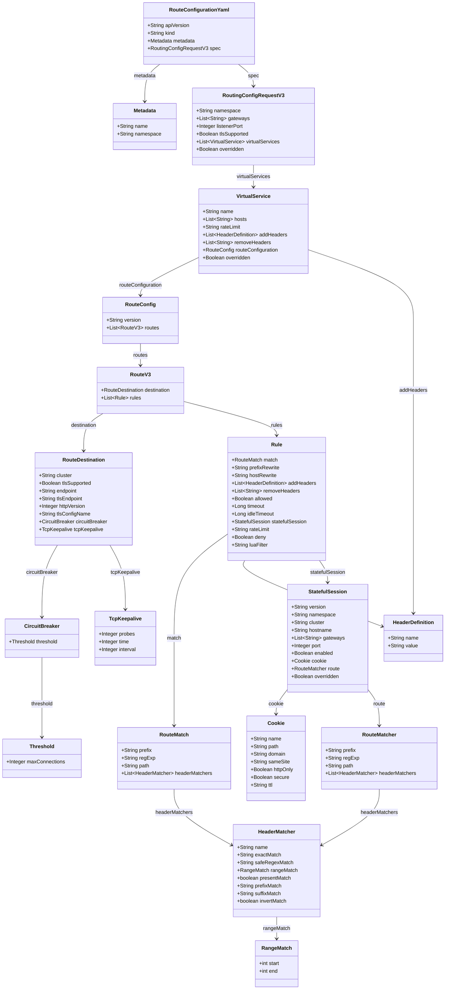

# RouteConfiguration to Gateway API/Istio Entity Mapping

## Overview

This document maps the RouteConfiguration custom resource entities to their corresponding Gateway API/Istio entities.

## RouteConfiguration Class Diagram

## Entity Mapping Table

### RouteConfiguration Core Mapping

| RouteConfiguration Entity           | Gateway API/Istio Entity | Mapping Description                                          | Notes |
|-------------------------------------|--------------------------|--------------------------------------------------------------|-------|
| `RouteConfigurationYaml.apiVersion` | -                        | -                                                            | -     |
| `RouteConfigurationYaml.kind`       | -                        | -                                                            | -     |
| `RouteConfigurationYaml.metadata`   | `HTTPRoute.metadata`     |                                                              |       |
| `RouteConfigurationYaml.spec`       | `HTTPRoute.spec`         | Main HTTPRoute content (parentRefs, hostnames, rules, etc.). |       |

### Metadata

| RouteConfiguration Entity | Gateway API/Istio Entity       | Mapping Description                        | Notes                                       |
|---------------------------|--------------------------------|--------------------------------------------|---------------------------------------------|
| `Metadata.name`           | `HTTPRoute.metadata.name`      | Name of the generated resource.            | Possibly with an added postfix              |
| `Metadata.namespace`      | `HTTPRoute.metadata.namespace` | Namespace for Gateway API/Istio resources. | Always matches the application's namespace? |

### RoutingConfigRequestV3 (Spec)

| RouteConfiguration Entity                  | Gateway API/Istio Entity                                                    | Mapping Description                                                       | Notes                                                                         |
|--------------------------------------------|-----------------------------------------------------------------------------|---------------------------------------------------------------------------|-------------------------------------------------------------------------------|
| `RoutingConfigRequestV3.namespace`         | ?                                                                           |                                                                           | When exactly does it differ from `RouteConfigurationYaml.metadata.namespace`? |
| `RoutingConfigRequestV3.gateways[]`        | `HTTPRoute.spec.parentRefs[].name` / `.namespace` / `.kind=Gateway`         | List of target Gateways the HTTPRoute will attach to.                     |                                                                               |
| `RoutingConfigRequestV3.listenerPort`      | ? `Gateway.spec.listeners[].port`?                                          | Target Gateway listener port?                                             | Not found in NC                                                               |
| `RoutingConfigRequestV3.tlsSupported`      | ? `Gateway.spec.listeners[].protocol` / Istio `Gateway.spec.servers[].tls`? | Flag indicating that routes must be served over TLS.                      | Not found in NC                                                               |
| `RoutingConfigRequestV3.virtualServices[]` | `HTTPRoute.spec.rules[]` + `HTTPRoute.spec.hostnames[]`                     | Set of virtual hosts and rules that are transformed into HTTPRoute rules. |                                                                               |
| `RoutingConfigRequestV3.overridden`        | ?                                                                           |                                                                           |                                                                               |

### VirtualService

| RouteConfiguration Entity           | Gateway API/Istio Entity                                              | Mapping Description                                             | Notes                                                                                                                                |
|-------------------------------------|-----------------------------------------------------------------------|-----------------------------------------------------------------|--------------------------------------------------------------------------------------------------------------------------------------|
| `VirtualService.name`               | ?                                                                     | Virtual service name.                                           | Always matches the gateway name?                                                                                                     |
| `VirtualService.hosts[]`            | `HTTPRoute.spec.hostnames[]`                                          | List of hosts the route matches.                                |                                                                                                                                      |
| `VirtualService.rateLimit`          | ? Istio `EnvoyFilter`                                                 | Global rate limit for the VirtualService.                       | In pure Gateway API, rate limiting is weakly standardized; Envoy/Istio often rely on an EnvoyFilter or an external RateLimitService. |
| `VirtualService.addHeaders[]`       | `HTTPRoute.spec.rules[].filters[]` with `type: RequestHeaderModifier` | Headers added to all rules of this VirtualService.              | In Gateway API, header filters are defined at the rule level; filters from the VirtualService should be added to every rule.         |
| `VirtualService.removeHeaders[]`    | `HTTPRoute.spec.rules[].filters[].requestHeaderModifier.remove`       | Headers removed at the VirtualService level.                    | Similarly—apply to each rule where a `HeaderModifier` is generated.                                                                  |
| `VirtualService.routeConfiguration` | `HTTPRoute.spec.rules[]`                                              | Reference to the RouteConfig that provides destination + rules. |                                                                                                                                      |
| `VirtualService.overridden`         | ?                                                                     |                                                                 |                                                                                                                                      |

### RouteConfig

| RouteConfiguration Entity | Gateway API/Istio Entity | Mapping Description                      | Notes                                                                                  |
|---------------------------|--------------------------|------------------------------------------|----------------------------------------------------------------------------------------|
| `RouteConfig.version`     | ?                        | Version of the route configuration.      |                                                                                        |
| `RouteConfig.routes[]`    | `HTTPRoute.spec.rules[]` | Set of routes to different destinations. | One `routes[]` element maps to one or more HTTPRoute rules with different backendRefs. |

### RouteV3

| RouteConfiguration Entity | Gateway API/Istio Entity                                  | Mapping Description                                       | Notes                                |
|---------------------------|-----------------------------------------------------------|-----------------------------------------------------------|--------------------------------------|
| `RouteV3.destination`     | `HTTPRoute.spec.rules[].backendRefs[]`                    | Description of the backend service receiving the traffic. |                                      |
| `RouteV3.rules[]`         | `HTTPRoute.spec.rules[].matches[]` + `.rules[].filters[]` | Set of match/filter rules for one destination.            | Can be merged if destinations match. |

### Rule

| RouteConfiguration Entity | Gateway API/Istio Entity                                                                       | Mapping Description                                 | Notes                                                                                              |
|---------------------------|------------------------------------------------------------------------------------------------|-----------------------------------------------------|----------------------------------------------------------------------------------------------------|
| `Rule.match`              | `HTTPRoute.spec.rules[].matches[]`                                                             | Path and header matching condition.                 |                                                                                                    |
| `Rule.prefixRewrite`      | `HTTPRoute.spec.rules[].filters[].type=URLRewrite` / `.urlRewrite.path.prefix`                 | Path prefix rewrite.                                |                                                                                                    |
| `Rule.hostRewrite`        | `HTTPRoute.spec.rules[].filters[].type=URLRewrite` / `.urlRewrite.hostname`                    | Host rewrite during proxying.                       |                                                                                                    |
| `Rule.addHeaders[]`       | `HTTPRoute.spec.rules[].filters[].type=RequestHeaderModifier`                                  | Headers added at the rule level.                    |                                                                                                    |
| `Rule.removeHeaders[]`    | `HTTPRoute.spec.rules[].filters[].requestHeaderModifier.remove[]` / `.responseHeaders.remove`  | Headers removed at the rule level.                  |                                                                                                    |
| `Rule.allowed`            | ?                                                                                              | Flag indicating whether the route is allowed.       |                                                                                                    |
| `Rule.timeout`            | ? Istio `VirtualService.http[].timeout`                                                        | Request processing timeout to the backend.          | Gateway API currently has weak timeout standardization; Istio provides full control.               |
| `Rule.idleTimeout`        | ? Istio `DestinationRule.trafficPolicy.connectionPool.http.idleTimeout` / Envoy cluster config | Idle timeout for the HTTP connection.               | More often described at the cluster/DestinationRule level rather than for a specific route.        |
| `Rule.statefulSession`    | ? Istio `VirtualService` + `DestinationRule` (session affinity / consistent hash)              | Description of stateful sessions / sticky sessions. | No direct analogue in Gateway API; implemented at the L7/L4 load balancer level (DestinationRule). |
| `Rule.rateLimit`          | ? EnvoyFilter / Istio rate limit                                                               | Rate limit for a specific rule.                     | Similar to VirtualService.rateLimit but at a more granular level.                                  |
| `Rule.deny`               | ?                                                                                              | Explicitly deny the route.                          |                                                                                                    |
| `Rule.luaFilter`          | ? EnvoyFilter (Lua filter)                                                                     | Custom Lua filter at the route level.               | Gateway API has no direct analogue; implemented through EnvoyFilter/WASM filters.                  |

### RouteDestination

| RouteConfiguration Entity         | Gateway API/Istio Entity                                                                             | Mapping Description                               | Notes                                                                                                 |
|-----------------------------------|------------------------------------------------------------------------------------------------------|---------------------------------------------------|-------------------------------------------------------------------------------------------------------|
| `RouteDestination.cluster`        | ?                                                                                                    |                                                   | What is it used for?                                                                                  |
| `RouteDestination.tlsSupported`   | ? `Gateway.spec.listeners[].protocol=HTTPS/TLS` / Istio `DestinationRule.trafficPolicy.tls`          | Flag indicating that the backend speaks TLS.      | Not found in NC                                                                                       |
| `RouteDestination.endpoint`       | `HTTPRoute.spec.rules[].backendRefs[].host` + `.backendRefs[].port`                                  | HTTP endpoint (host:port) for the backend.        | Needs to be parsed and stored as separate host and port. The port can be a placeholder, not a number! |
| `RouteDestination.tlsEndpoint`    | ? Istio `DestinationRule.trafficPolicy.tls.sni`                                                      | TLS endpoint                                      |                                                                                                       |
| `RouteDestination.httpVersion`    | ? Envoy cluster config / Istio `DestinationRule.trafficPolicy.connectionPool.http.useClientProtocol` | HTTP version when communicating with the backend. | Gateway API does not describe this.                                                                   |
| `RouteDestination.tlsConfigName`  | ? Istio `DestinationRule.trafficPolicy.tls.credentialName` / SecretRef                               | Reference to a TLS config/secret.                 | Most often maps to the secret used for mTLS/TLS to the backend.                                       |
| `RouteDestination.circuitBreaker` | ? Istio `DestinationRule.trafficPolicy.outlierDetection`                                             | Circuit breaking for the backend.                 |                                                                                                       |
| `RouteDestination.tcpKeepalive`   | ? Istio `DestinationRule.trafficPolicy.connectionPool.tcp.tcpKeepalive`                              | TCP keepalive settings for backend connections.   | No direct analogue in Gateway API (this is at the L4/cluster level).                                  |

### RouteMatch

| RouteConfiguration Entity     | Gateway API/Istio Entity                                                  | Mapping Description                    | Notes                                  |
|-------------------------------|---------------------------------------------------------------------------|----------------------------------------|----------------------------------------|
| `RouteMatch.prefix`           | `HTTPRoute.spec.rules[].matches[].path.type=PathPrefix` + `.value`        | Match by path prefix.                  |                                        |
| `RouteMatch.regExp`           | `HTTPRoute.spec.rules[].matches[].path.type=RegularExpression` + `.value` | Path match by regular expression.      | Support depends on the implementations |
| `RouteMatch.path`             | `HTTPRoute.spec.rules[].matches[].path.type=Exact` + `.value`             | Exact path match.                      |                                        |
| `RouteMatch.headerMatchers[]` | `HTTPRoute.spec.rules[].matches[].headers[]`                              | Header match (name/value/regex, etc.). |                                        |

### HeaderMatcher

| RouteConfiguration Entity      | Gateway API/Istio Entity                                                                         | Mapping Description                                | Notes                                                    |
|--------------------------------|--------------------------------------------------------------------------------------------------|----------------------------------------------------|----------------------------------------------------------|
| `HeaderMatcher.name`           | `HTTPRoute.spec.rules[].matches[].headers[].name`                                                | Header name.                                       |                                                          |
| `HeaderMatcher.exactMatch`     | `HTTPRoute.spec.rules[].matches[].headers[].value` with `Exact`                                  | Exact match for the header value.                  |                                                          |
| `HeaderMatcher.safeRegexMatch` | `HTTPRoute.spec.rules[].matches[].headers[].value` with `RegularExpression`                      | Regular expression for the header value.           | The backend must support regex.                          |
| `HeaderMatcher.rangeMatch`     | ? Istio `VirtualService.http[].match[].headers[name].range`                                      | Range of values (usually for numeric headers).     | In pure Gateway API, header ranges are not standardized. |
| `HeaderMatcher.presentMatch`   | `HTTPRoute.spec.rules[].matches[].headers[].value` with `RegularExpression` and a modified value | Check for header presence (value does not matter). | `.*`                                                     |
| `HeaderMatcher.prefixMatch`    | `HTTPRoute.spec.rules[].matches[].headers[].value` with `RegularExpression` and a modified value | Match value by prefix.                             | `^prefix.*$`                                             |
| `HeaderMatcher.suffixMatch`    | `HTTPRoute.spec.rules[].matches[].headers[].value` with `RegularExpression` and a modified value | Match value by suffix.                             | `.*prefix$`                                              |
| `HeaderMatcher.invertMatch`    | ? Istio `VirtualService.http[].match[].headers[name].invertMatch`                                | Invert the match condition.                        |                                                          |

### RangeMatch

| RouteConfiguration Entity | Gateway API/Istio Entity                                          | Mapping Description       | Notes |
|---------------------------|-------------------------------------------------------------------|---------------------------|-------|
| `RangeMatch.start`        | ? Istio `VirtualService.http[].match[].headers[name].range.start` | Lower bound of the range. |       |
| `RangeMatch.end`          | ? Istio `VirtualService.http[].match[].headers[name].range.end`   | Upper bound of the range. |       |

### HeaderDefinition

| RouteConfiguration Entity | Gateway API/Istio Entity                                             | Mapping Description                         | Notes                                                                  |
|---------------------------|----------------------------------------------------------------------|---------------------------------------------|------------------------------------------------------------------------|
| `HeaderDefinition.name`   | `HTTPRoute.spec.rules[].filters[].requestHeaderModifier.add[].name`  | Name of the header being added/overwritten. | In Gateway API, adding and replacing headers use the same filter type. |
| `HeaderDefinition.value`  | `HTTPRoute.spec.rules[].filters[].requestHeaderModifier.add[].value` | Header value.                               |                                                                        |

### CircuitBreaker / Threshold

| RouteConfiguration Entity  | Gateway API/Istio Entity                                                  | Mapping Description                                            | Notes                                            |
|----------------------------|---------------------------------------------------------------------------|----------------------------------------------------------------|--------------------------------------------------|
| `CircuitBreaker.threshold` | ? Istio `DestinationRule.trafficPolicy.outlierDetection`                  | Circuit breaking parameters.                                   | In Envoy—max connections, pending requests, etc. |
| `Threshold.maxConnections` | ? Istio `DestinationRule.trafficPolicy.connectionPool.tcp.maxConnections` | Maximum number of simultaneous TCP connections to the backend. | Gateway API does not describe such L4 details.   |

### TcpKeepalive

| RouteConfiguration Entity | Gateway API/Istio Entity                                                         | Mapping Description                  | Notes                         |
|---------------------------|----------------------------------------------------------------------------------|--------------------------------------|-------------------------------|
| `TcpKeepalive.probes`     | ? Istio `DestinationRule.trafficPolicy.connectionPool.tcp.tcpKeepalive.probes`   | Number of TCP keepalive probes.      | Low-level Envoy/TCP settings. |
| `TcpKeepalive.time`       | ? Istio `DestinationRule.trafficPolicy.connectionPool.tcp.tcpKeepalive.time`     | Idle time before starting keepalive. |                               |
| `TcpKeepalive.interval`   | ? Istio `DestinationRule.trafficPolicy.connectionPool.tcp.tcpKeepalive.interval` | Interval between keepalive probes.   |                               |

### Cookie

| RouteConfiguration Entity | Gateway API/Istio Entity                                                            | Mapping Description              | Notes                                                       |
|---------------------------|-------------------------------------------------------------------------------------|----------------------------------|-------------------------------------------------------------|
| `Cookie.name`             | ? Istio `DestinationRule.trafficPolicy.loadBalancer.consistentHash.httpCookie.name` | Cookie name for sticky sessions. |                                                             |
| `Cookie.path`             | ? `...httpCookie.path`                                                              | Path for the cookie.             |                                                             |
| `Cookie.domain`           | ? (no direct field in Istio cookie; host is used)                                   | Cookie domain.                   | Can be emulated via Lua/EnvoyFilter if critical.            |
| `Cookie.sameSite`         | ? EnvoyFilter / Lua / WASM                                                          | SameSite policy.                 | Neither Gateway API nor Istio defines this in the core API. |
| `Cookie.httpOnly`         | ? EnvoyFilter / Lua / WASM                                                          | HttpOnly flag.                   | Similarly.                                                  |
| `Cookie.secure`           | ? EnvoyFilter / Lua / WASM                                                          | Secure flag.                     | Similarly.                                                  |
| `Cookie.ttl`              | ? Istio `DestinationRule.trafficPolicy.loadBalancer.consistentHash.httpCookie.ttl`  | Cookie lifetime.                 | TTL exists in the Istio API.                                |

### StatefulSession

| RouteConfiguration Entity    | Gateway API/Istio Entity                                                                           | Mapping Description                                        | Notes                                                               |
|------------------------------|----------------------------------------------------------------------------------------------------|------------------------------------------------------------|---------------------------------------------------------------------|
| `StatefulSession.version`    | ? Annotation `VirtualService.metadata.annotations["mesh/stateful-version"]`                        | Version of the stateful session configuration.             | For debugging.                                                      |
| `StatefulSession.namespace`  | ? `VirtualService.metadata.namespace` / `DestinationRule.metadata.namespace`                       | Namespace of the resources providing the stateful session. | Usually matches the backend service.                                |
| `StatefulSession.cluster`    | ? Istio `DestinationRule.host`                                                                     | Cluster/host that session affinity is attached to.         |                                                                     |
| `StatefulSession.hostname`   | ? Istio `DestinationRule.trafficPolicy.loadBalancer.consistentHash.httpHeaderName` / `useSourceIp` | Hostname used for session hashing.                         | Depends on the sticky-session mechanism.                            |
| `StatefulSession.gateways[]` | ? `HTTPRoute.spec.parentRefs[]` / annotations                                                      | List of gateways for which stateful is enabled.            | You can use an annotation on the HTTPRoute/Gateway.                 |
| `StatefulSession.port`       | ? `DestinationRule.subsets[].port` / `Service.spec.ports[]`                                        | Backend port for stateful traffic.                         |                                                                     |
| `StatefulSession.enabled`    | ? Istio `DestinationRule.trafficPolicy.loadBalancer.consistentHash` (present/absent)               | Flag for enabling sticky sessions.                         | If `false`, the corresponding policy is simply not created/applied. |
| `StatefulSession.cookie`     | ? Istio `DestinationRule.trafficPolicy.loadBalancer.consistentHash.httpCookie`                     | Cookie-based sticky session configuration.                 | See `Cookie` below.                                                 |
| `StatefulSession.route`      | ? Istio `VirtualService.http[].match` and `.route` with the corresponding policy                   | Special route to which stateful applies.                   | Essentially a separate HTTP route with affinity.                    |
| `StatefulSession.overridden` | ? Annotation                                                                                       | Flag for overriding the stateful configuration.            | Implement the effect yourself.                                      |

### RouteMatcher

| RouteConfiguration Entity       | Gateway API/Istio Entity | Mapping Description                    | Notes                                  |
|---------------------------------|--------------------------|----------------------------------------|----------------------------------------|
| `RouteMatcher.prefix`           | ?                        | Match by path prefix.                  |                                        |
| `RouteMatcher.regExp`           | ?                        | Path match by regular expression.      | Support depends on the implementations |
| `RouteMatcher.path`             | ?                        | Exact path match.                      |                                        |
| `RouteMatcher.headerMatchers[]` | ?                        | Header match (name/value/regex, etc.). |                                        |
| `RouteMatcher.addHeaders[]`     | ?                        | Headers to add                         |                                        |
| `RouteMatcher.removeHeaders[]`  | ?                        | Headers to remove                      |                                        |
