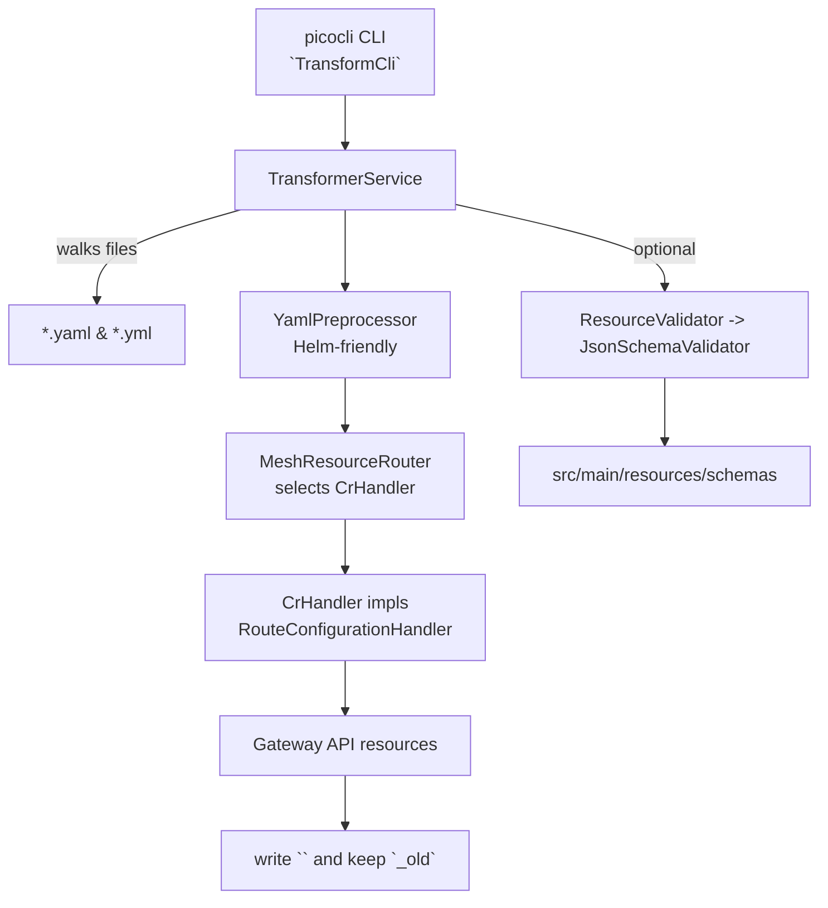

# ReMesh Technical Design

## Overview
ReMesh transforms Core Mesh `Mesh` custom resources into Gateway API manifests. The CLI walks a directory, preprocesses Helm-friendly YAML, routes `Mesh` fragments to handlers, and writes Gateway API resources (currently `HTTPRoute`) back to the original filename while keeping the previous content in a sibling file with an `_old` suffix. Optional validation checks generated manifests against bundled CRD schemas.



## Runtime flow
1. **CLI entry point** — [`TransformCli`](../src/main/java/org/qubership/remesh/TransformCli.java) parses `-d/--dir` and `-v/--validate` flags and invokes `TransformerService`.
2. **File processing** — [`TransformerService`](../src/main/java/org/qubership/remesh/TransformerService.java):
   - walks the directory tree and filters `.yaml`/`.yml` files;
   - splits multi-document YAML on `---` and preprocesses fragments to handle Helm templates via [`YamlPreprocessor`](../src/main/java/org/qubership/remesh/serialization/YamlPreprocessor.java);
   - routes parsed fragments to mesh handlers through [`MeshResourceRouter`](../src/main/java/org/qubership/remesh/handler/MeshResourceRouter.java);
   - renames the original file to `<original>_old` and writes generated resources to the original filename in YAML form.
3. **Routing** — `MeshResourceRouter` checks `apiVersion`, `kind`, and `subKind` to select a `CrHandler` from [`CrHandlerRegistry`](../src/main/java/org/qubership/remesh/handler/CrHandlerRegistry.java) (Java `ServiceLoader`).
4. **Current handler** — [`RouteConfigurationHandler`](../src/main/java/org/qubership/remesh/handler/RouteConfigurationHandler.java) maps `RouteConfiguration` fragments into Gateway API [`HttpRoute`](../src/main/java/org/qubership/remesh/dto/gatewayapi/HttpRoute.java) objects: builds `parentRefs`, hostnames, path/header matches, header rewrite filters, and backend references via [`EndpointParser`](../src/main/java/org/qubership/remesh/util/EndpointParser.java).
5. **Validation (optional)** — [`ResourceValidator`](../src/main/java/org/qubership/remesh/validation/ResourceValidator.java) derives a schema name from `apiVersion`/`kind` and delegates to [`JsonSchemaValidator`](../src/main/java/org/qubership/remesh/validation/JsonSchemaValidator.java) to validate against CRD files under [`src/main/resources/schemas`](../src/main/resources/schemas).

### Example invocation
```bash
java -jar target/remesh-1.0.0.jar \
  --dir ./configs \
  --validate
```
Produces files like `configs/sample.yaml` with one or more `HTTPRoute` documents while preserving the prior content in `configs/sample.yaml_old`.

## Data contracts
- Input: Core Mesh `Mesh` with `subKind=RouteConfiguration` shaped by DTOs under [`src/main/java/org/qubership/remesh/dto`](../src/main/java/org/qubership/remesh/dto) (e.g., [`RouteConfigurationYaml`](../src/main/java/org/qubership/remesh/dto/RouteConfigurationYaml.java), [`VirtualService`](../src/main/java/org/qubership/remesh/dto/VirtualService.java)).
- Output: Gateway API resources implementing [`Resource`](../src/main/java/org/qubership/remesh/handler/Resource.java); currently [`HttpRoute`](../src/main/java/org/qubership/remesh/dto/gatewayapi/HttpRoute.java) is generated.

## Extension points
### Adding a new handler
1. Implement [`CrHandler`](../src/main/java/org/qubership/remesh/handler/CrHandler.java) for a new `subKind`.
2. Register the class in [`META-INF/services/org.qubership.remesh.handler.CrHandler`](../src/main/resources/META-INF/services/org.qubership.remesh.handler.CrHandler) so `ServiceLoader` can discover it.
3. Keep the implementation small and focused; reuse `ObjectMapperProvider` for YAML mapping and follow the existing pattern in `RouteConfigurationHandler` for logging and null-handling.

```java
@Slf4j
public class MyHandler implements CrHandler {
    @Override public String getKind() { return "MyKind"; }

    @Override
    public List<Resource> handle(JsonNode node) {
        MySpec spec = ObjectMapperProvider.getMapper().treeToValue(node, MySpec.class);
        // map spec to Gateway API resources
        return List.of(buildResource(spec));
    }
}
```

### Adding validation for new resources
- Drop a CRD file into [`src/main/resources/schemas`](../src/main/resources/schemas) named `<apiVersion>_<kind>.yaml` (lowercase, without the `/vX` suffix). The name is derived by `ResourceValidator.schemaFileName`.
- The CRD should expose the OpenAPI v3 schema under `spec.versions[].name == "v1"` so `JsonSchemaValidator` can load it.

### Updating preprocessing or parsing rules
- [`YamlPreprocessor`](../src/main/java/org/qubership/remesh/serialization/YamlPreprocessor.java) centralizes Helm-template handling; extend it if more templating patterns appear.
- [`EndpointParser`](../src/main/java/org/qubership/remesh/util/EndpointParser.java) is the single place for decoding backend endpoints (`scheme://host:port`). Adjust it if new endpoint formats are required.

## Useful references
- Existing mapping research: [`docs/general-mapping.md`](general-mapping.md) and [`docs/route-configuration-mapping.md`](route-configuration-mapping.md).
- Tests demonstrating behavior: [`src/test/java/org/qubership/remesh`](../src/test/java/org/qubership/remesh).
